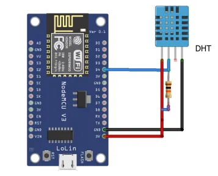
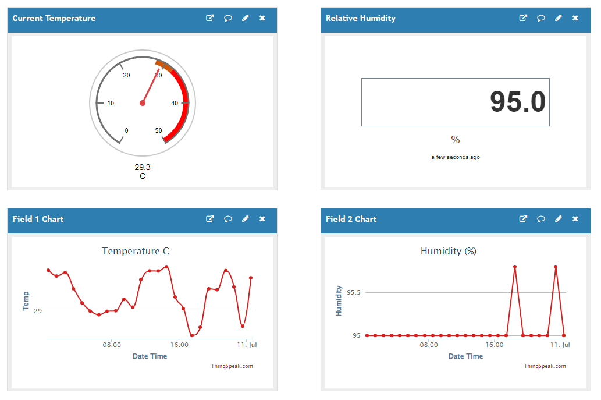

# ESP8266 Weather Station
The simplest weather station using ESP8266 & DHT11 sensor with Thingspeak integration.

### Components:

1. ESP8266
2. DHT11

### Circuit Diagram

### Visualize data on Thingspeak

https://thingspeak.com/channels/1160774

